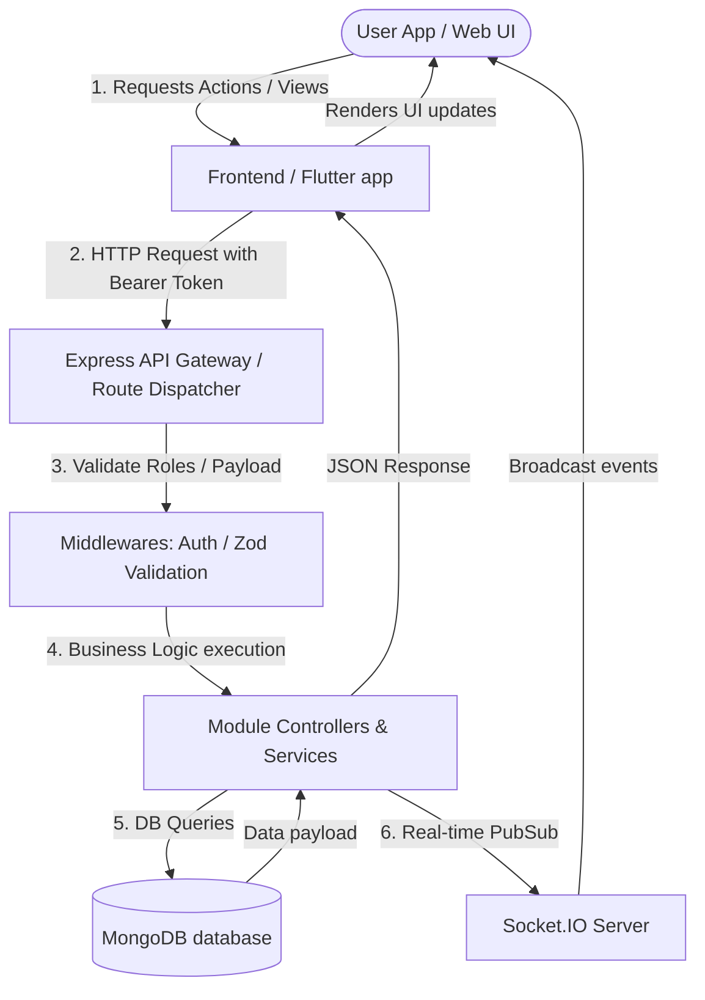

# PopBom — Enterprise Omnichannel Social Video & Challenge Platform

PopBom is a high-performance, mobile-first social media and interactive challenge platform. The architecture is composed of a modular **Node.js/Express/TypeScript backend** powered by **MongoDB**, a administrative/landing **Next.js frontend**, and a cross-platform **Flutter mobile application**. The system is built for real-time engagement, low-latency live streaming (Agora), audio/video analysis, speech-to-text transcriptions, and automated challenge tracking.

---

## 📖 Executive Summary

PopBom enables users to create reels, share daily stories, join time-bound interactive video challenges, tip content creators using gifts, stream live content via WebRTC/Agora, and interact in real-time through Socket.IO. By offering AI-powered video recommendation, audio transcription (Deepgram), and semantic search interfaces, PopBom bridges traditional social entertainment with state-of-the-art intelligent services.

- **Primary Purpose:** A gamified, video-centric social network.
- **Business Goal:** High user engagement and retention through challenges, digital gifting economies, and real-time interaction.
- **Target Audience:** Content creators, Gen-Z mobile users, and community organizers.

---

## 🛠️ Technology Stack

| Layer | Technology | Key Features & Libraries |
| :--- | :--- | :--- |
| **Mobile Client** | **Flutter** (Dart) | GetX, Provider, `just_audio`, Socket.IO Client, Agora RTC Engine, `camera`, `video_player` |
| **Web Frontend** | **Next.js 15** (React 19) | Tailwind CSS 4, Axios, `js-cookie`, Recharts, React Icons |
| **Application Backend** | **Node.js** & **Express** | TypeScript, Mongoose, Socket.IO Server, Zod validator, Multer, Winston/Console |
| **Database** | **MongoDB** | Schema validations, Compound Indexes, Ref relationships |
| **Media & Storage** | **Cloudinary** | `multer-storage-cloudinary` integration for videos, images, and audio |
| **AI & Third-Party** | **Deepgram, OpenAI, Spotify, Agora, Shurjopay** | Video captioning, transcription, visual semantic search, audio streaming |

---

## 📂 Project Structure

```text
PopBom/
├── backend/                       # Node.js/Express/TypeScript REST API & Socket.IO server
│   ├── src/
│   │   ├── app/                   # Core application setup and configurations
│   │   │   ├── config/            # Server environment config files
│   │   │   ├── errors/            # Custom AppError class and error simplification utils
│   │   │   ├── interfaces/        # Global/shared TypeScript interfaces
│   │   │   ├── middleware/        # Global middlewares (authentication, uploads, sanitization)
│   │   │   ├── routes/            # Application entry router
│   │   │   └── utils/             # Express handlers (catchAsync, helpers)
│   │   ├── module/                # Domain-driven features (modular design pattern)
│   │   │   ├── User/              # User account storage, auth state
│   │   │   ├── Post/              # Reels, challenge video posts, and metadata
│   │   │   ├── Story/             # 24-hour visual updates
│   │   │   ├── Challenge/         # Gamified video challenge management
│   │   │   ├── Chat/              # Socket.IO conversations & messages
│   │   │   ├── Live/              # Agora streaming channels & socket states
│   │   │   ├── Point/             # User loyalty points and billing histories
│   │   │   └── ... (see modules explanation below)
│   │   ├── app.ts                 # Express app definition & midllewares configuration
│   │   └── server.ts              # HTTP & Socket.IO server entry point
│   ├── package.json
│   └── tsconfig.json
│
├── frontend/                      # Next.js admin dashboard and landing portal
│   ├── app/                       # Next.js App Router
│   │   ├── (dashboard)/           # Dashboard routes
│   │   │   ├── (auth)/            # Login, verification, password recovery
│   │   │   └── (dashboard protected)/ # Protected admin tools (users, reports, settings)
│   │   ├── (landing page)/        # Marketing content, terms, and privacy policy
│   │   ├── context/               # Global state contexts (Theme, global data)
│   │   └── providers.jsx          # React state wrapping providers
│   ├── next.config.mjs            # Next.js configurations
│   └── package.json
│
└── app/                           # Flutter mobile application
    ├── lib/                       # Dart source files
    │   ├── app/                   # Controller bindings and application boot setup
    │   ├── core/                  # Core services (Network clients, notification dispatchers)
    │   ├── features/              # Feature directories (auth, chat, home, challenge, profile)
    │   ├── theme/                 # Dark/Light theme styles
    │   └── main.dart              # Flutter application root entry
    ├── pubspec.yaml               # Flutter package configurations
    └── assets/                    # Static app graphics, icons, and fonts
```

### Folder Explanations

1. **`backend/src/module/`**: Houses all business domains. Each folder contains its own route file (`*.route.ts`), service layer (`*.service.ts`), controller (`*.controller.ts`), database schema/model (`*.model.ts`), and request validator (`*.validation.ts`).
2. **`frontend/app/(dashboard protected)`**: Administrative interface restricted to administrators for managing reported content, checking system health, configuring dynamic rules, and banning/suspending accounts.
3. **`app/lib/features/`**: Follows a clean modular directory layout in Dart. Split into user-facing view components (`/ui`), state handlers (`/controllers`), and networking repositories.

---

## 🔄 Application Flow



### Authentication Flow (JWT + OAuth)
1. **Traditional Route**: User submits credentials to `/api/auth/login`. On success, backend returns an `accessToken` (short-lived JSON payload) and sets a `refreshToken` in an HTTP-only Cookie.
2. **OAuth Route**: Handled through Firebase/Google/Apple provider credentials. Mobile app fetches token from platform SDK, forwards it to `/api/auth/google` or `/api/auth/apple`, and receives the same JWT schema.
3. **Token Refresh**: When the `accessToken` expires, the client calls `/api/auth/refresh-token` supplying the HTTP Cookie. The backend issues a brand-new access token if the refresh token is valid and unexpired.

---

## 🗄️ Database Documentation

PopBom uses Mongoose schema-enforced collections. The following models outline the primary entities:

### 1. `User` (Collection: `users`)
- **Purpose**: Stores base user login accounts, credentials, points, and QR scan strings.
- **Fields**:
  - `username` (String, Required, Unique)
  - `email` (String, Required, Match validation)
  - `mobile` (String, Unique, Sparse)
  - `password` (String, Required, Select: false)
  - `role` (String, Enum: `['user', 'admin']`, Default: `'user'`)
  - `provider` (String, Enum: `['local', 'google', 'apple']`, Default: `'local'`)
  - `googleId` (String, Sparse)
  - `appleId` (String, Sparse)
  - `points` (Number, Default: `100`)
  - `status` (String, Default: `'active'`)
  - `isOTPVerified` (Boolean, Default: `false`)
  - `scanCode` (String, Unique, Indexed)
- **Relationships**: Parent reference to `UserDetails` and `UserSettings`.

### 2. `UserDetails` (Collection: `userdetails`)
- **Purpose**: Stores profile-related custom information.
- **Fields**:
  - `userId` (ObjectId, Ref: `User`, Required, Unique)
  - `name` (String, Required)
  - `bio` (String, Default: `''`)
  - `photo` (String, Default: `''` - Cloudinary CDN URL)
  - `instaLink` (String)
  - `youtubeLink` (String)

### 3. `Post` (Collection: `posts`)
- **Purpose**: Short reels, challenge entries, and video uploads.
- **Fields**:
  - `title` (String)
  - `body` (String)
  - `authorId` (ObjectId, Ref: `User`, Required)
  - `challengeId` (ObjectId, Ref: `Challenge`)
  - `videoUrl` (String, Required)
  - `musicUrl` (String)
  - `location` (String)
  - `status` (String, Enum: `['active', 'banned', 'hide']`, Default: `'active'`)
  - `audience` (String, Enum: `['everyone', 'follower']`, Default: `'everyone'`)
  - `postType` (String, Enum: `['reels', 'challenges', 'story']`, Required)

### 4. `Live` (Collection: `lives`)
- **Purpose**: Holds active and completed Agora live broadcast metadata.
- **Fields**:
  - `userId` (ObjectId, Ref: `User`, Required, Indexed)
  - `channel` (String, Required, Unique, Indexed)
  - `isLive` (Boolean, Default: `true`, Indexed)
  - `startedAt` (Date, Default: Date.now)
  - `endedAt` (Date)
  - `viewerCount` (Number, Default: `0`)

---

## 📡 API Documentation

### Auth Module (`/api/auth`)

#### `POST /api/auth/register`
- **Description**: Registers a new local authentication user.
- **Authentication**: None.
- **Request Body**:
  ```json
  {
    "username": "johndoe",
    "email": "johndoe@example.com",
    "password": "Password123"
  }
  ```
- **Success Response**: `201 Created` with access token and user metadata.

#### `POST /api/auth/login`
- **Description**: Authenticates local credentials, returning JWT.
- **Authentication**: None.
- **Success Response**: `200 OK` + HTTP-only Cookie (`refreshToken`).

---

## ⚙️ Environment Variables

### Backend (`backend/.env`)

| Variable | Required | Description | Example |
| :--- | :--- | :--- | :--- |
| `PORT` | Yes | HTTP interface listener port | `5000` |
| `DATABASE_URL` | Yes | MongoDB Connection String URI | `mongodb+srv://...` |
| `JWT_ACCESS_SECRET` | Yes | Secret signature string for access JWT | `super_secret_access_key` |
| `JWT_REFRESH_SECRET`| Yes | Secret signature string for refresh JWT | `super_secret_refresh_key`|
| `EMAIL_USER` | No | SMTP mailing address (OTP services) | `popbom.app@gmail.com` |
| `EMAIL_PASS` | No | App-specific email password | `passkey123` |
| `CLOUDINARY_API_KEY`| Yes | Media storage public API key | `766595667346798` |
| `CLOUDINARY_API_SECRET`| Yes| Media storage private signature key | `ub4M5ZE27kAI-MkNmoJW` |
| `SPOTIFY_CLIENT_ID` | No | Audio API provider credential ID | `e55079200ca24c9a85` |

---

## 🚀 Quick Start & Installation

### 1. Clone & Set Up Backend
```bash
cd backend
npm install
cp .env.example .env
# Edit your .env with MongoDB credentials
npm run start:dev
```

### 2. Set Up Frontend Web
```bash
cd ../frontend
npm install
npm run dev
```

### 3. Run Mobile App
Ensure you have the Flutter SDK (>=3.9.2) installed:
```bash
cd ../app
flutter pub get
flutter run
```

---

## 🛡️ Security Best Practices
- **Password Protection**: Salting and hashing passwords via `bcrypt` (12 rounds) prior to database persistence.
- **Cross-Origin Resource Sharing (CORS)**: Restricting API calls to approved dashboard domains.
- **Payload Validation**: Hard schema validation of requests using `zod` prevents script injections and format anomalies.
- **Access Restrictions**: Built-in `auth` routing middleware restricts admin endpoints to accounts carrying the `admin` role string.

---

## ⚠️ Known Limitations
1. **Redis Caching**: Caching for active streams or online counts is currently missing; Socket.IO keeps local variables.
2. **Missing Unit Tests**: No testing frameworks are configured on the Node backend or Next.js app.
3. **Local Storage Fallback**: File uploads default to an in-memory memory storage option when Cloudinary configurations fail.

---

## 📄 License
This project is licensed under the **ISC License** as registered in the backend configuration parameters.
